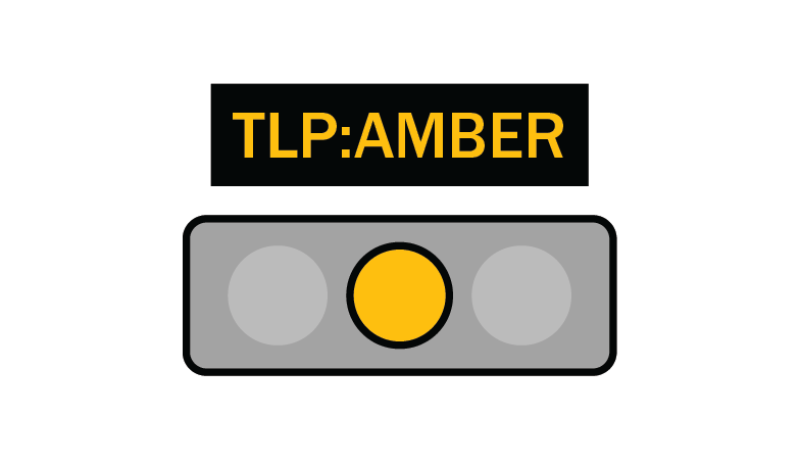

This repository is TLP:AMBER, for reasons of:
- this repository, its issues, history, and other data may contain private information
- this repository, its issues, history, and other data may contain unencrypted authentication keys and secrets, leakage of which may impact operations
For further information please see [https://www.cisa.gov/news-events/news/traffic-light-protocol-tlp-definitions-and-usage](https://www.cisa.gov/news-events/news/traffic-light-protocol-tlp-definitions-and-usage) for details.

Note, this repo uses git-subtree.
