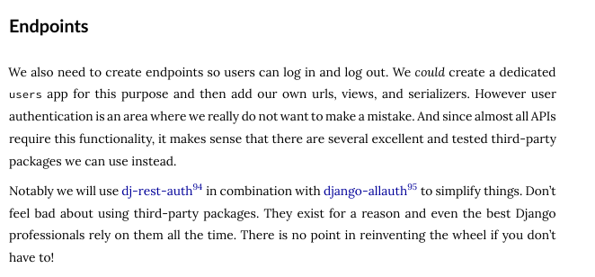
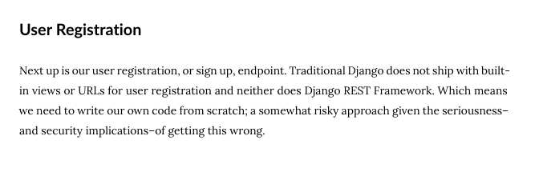

# Dependencies
- django
- djangorestframework
- dj-rest-auth
- django-allauth==0.58
- psycopg 
- drf-spectacular

# Why we need dj-rest-auth and django-allauth?

# Setup
- Clone the repository
- Install dependencies (pip, conda or poetry)
- Setup a postgres db for django with this [guide](https://docs.djangoproject.com/en/4.2/ref/databases/#postgresql-notes)

        The connection service is located in $HOME.
        The .my_pgpass file should be located in /project/components/fincsi_backend/

- Run python manage.py migrate
- Run python manage.py runserver

# Documentation
- [django](https://docs.djangoproject.com/en/4.2/)
- [djangorestframework](https://www.django-rest-framework.org/)
- [dj-rest-auth](https://dj-rest-auth.readthedocs.io/en/latest/)
- [django-allauth](https://docs.allauth.org/en/latest/)
- [psycopg](https://www.psycopg.org/docs/)
- [drf-spectacular](https://drf-spectacular.readthedocs.io/en/latest/readme.html)

# pg_service.conf example:

[fincsidb]
host=localhost
user=postgres
dbname=fincsidb
port=5432

# .my_pgpass example:
localhost:5432:fincsidb:postgres:password